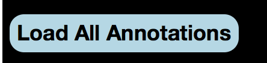
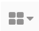
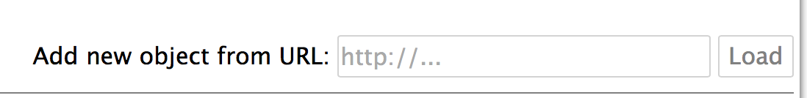

# IIIF-Annotate

Create/store/load static annotations on IIIF manifests via Jekyll

## Getting started
<!-- TOC depthFrom:3 depthTo:6 withLinks:1 updateOnSave:1 orderedList:0 -->

- [Creating Github site and hosting annotations](#creating-github-site-and-hosting-annotations)
- [Running Locally](#running-locally)
- [Create personal Annotations site, create and load new annotations.](#create-personal-annotations-site-create-and-load-new-annotations)
- [Create Annotations](#create-annotations)
- [Requirements for Development](#requirements-for-development)
- [Development](#development)

<!-- /TOC -->
### Creating Github site and hosting annotations

- Login into Github account.

- Navigate to https://github.com/dnoneill/annotate and Fork the repository.

- Follow the directions in "Running Locally" below

### Running Locally
- Clone this repository or fork and navigate into it:

  `$ git clone https://github.com/[username]/annotate.git && cd annotate`

- Install Vagrant https://www.vagrantup.com/downloads.html

- Install vagrant plugin

  ` $ vagrant plugin install vagrant-sshfs`

- Start vagrant environment

  `$ vagrant up`

- Start Jekyll and Flask

  `$ vagrant ssh`

  `[vagrant@localhost ~]$ cd /vagrant`

  `[vagrant@localhost ~]$ ./run.sh`

- Navigate to http://0.0.0.0:4000/annotate to create annotations

- IMPORTANT!!!!! After creating annotations make sure to click on the "Load All Annotations" button  located in the bottom left hand corner of the Mirador viewer. If this is not done, no annotations will be created or deleted. This only has to be done before navigating away from the create annotations page . It does not have to be done when switching between manifests.

### Create personal Annotations site, create and load new annotations.
This application allows for the site run locally to be hosted on GitHub pages. Unfortunately new annotations can not be created using GitHub pages, creation has to be done locally, but new annotations can be hosted and viewed on a GitHub pages site. This allows for easy sharing and reuse. The instructions explain how to create a site that works in the same way as https://dnoneill.github.io/annotate/. Creation of this site allows for embed codes like: `<iiif-annotation annotationurl="https://dnoneill.github.io/annotate/annotations/mc00084-001-te0159-000-001-0001-1.json"></iiif-annotation>` to work on other sites.

- After forking the site, go to the Settings tab.
- Scroll down to the GitHub Pages section
- In the Source dropdown select "master branch"
- Click "Save"
- After new annotations have been created or deleted, navigate to the "annotate" folder on your device.
- type in `git status`
- The window should show a number of annotations in red text.
- type in `git add _annotations` to add all annotation changes.
- type in `git commit -m "message for commit here, usually can be something simple like 'new images'"`
- type in `git push origin master`
Github normally takes a minute to rebuild the site. After the items should be rendered and available for viewing and reuse on the site.

### Create Annotations
IMPORTANT!!!!! After creating annotations make sure to click on the "Load All Annotations" button  located in the bottom left hand corner of the Mirador viewer. If this is not done, no annotations will be created or deleted. This only has to be done before navigating away from the create annotations page . It does not have to be done when switching between manifests.
- Navigate to the create annotations page. http://0.0.0.0:4000/annotate
- To load a new manifest hover on the "Change number of visible slots button" 
- Click on the replace object button 
- Load manifest url into new object from url slot 
- Click on the toggle annotations button in the viewer.
- Create annotations using tools provided by IIIF viewer.
- Click on "Load All Annotations" button.

### Requirements for Development
- Ruby >=2.2
- Jekyll >=3.5
- Bundler >=1.12
- Python

### Development
- Clone this repository and navigate into it:

  `$ git clone https://github.com/dnoneill/annotate.git && cd annotate`
- Install dependencies:

  `$ bundle install`
- Create ENV, install Flask in ENV, start Flask and Jekyll

  `$ ./run.sh`
